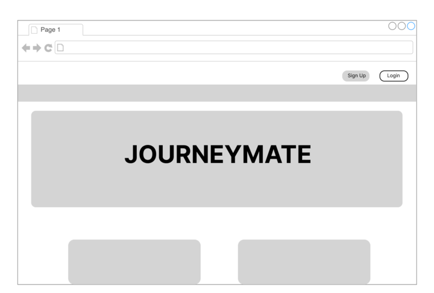
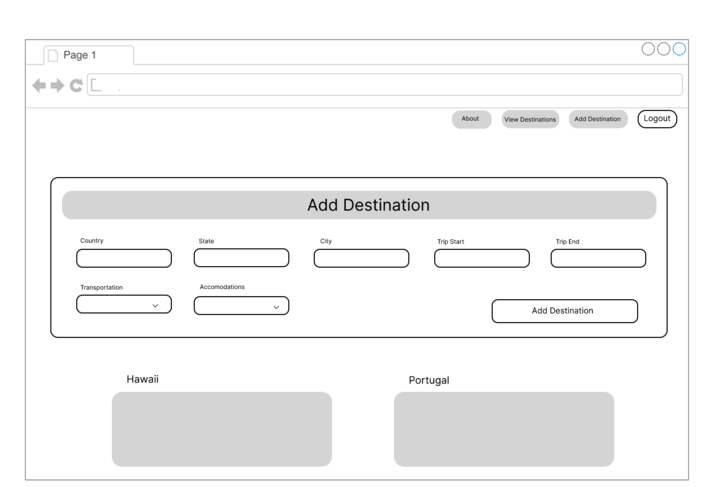
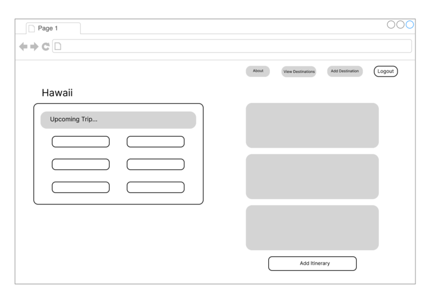
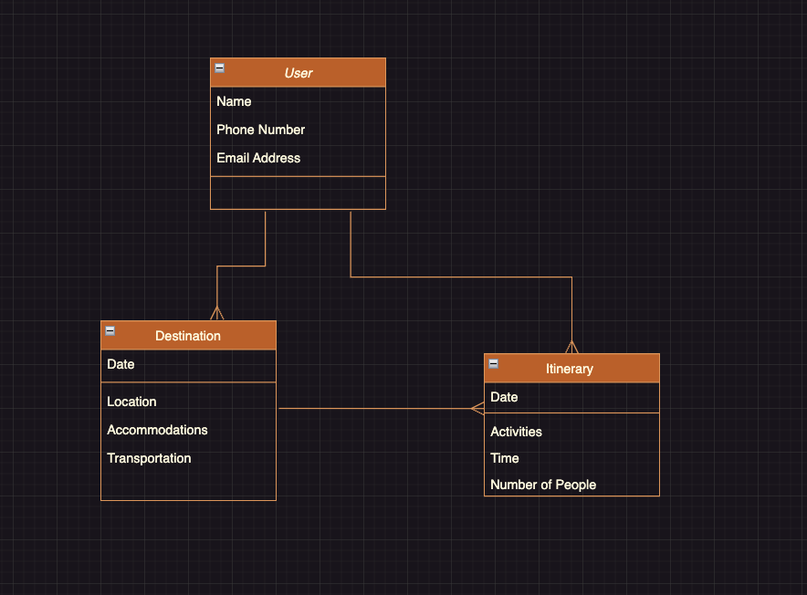

# JourneyMate

### Date: 06/21/2023

---

## **_Description_**

#### Travel Planner, a comprehensive web application that simplifies travel planning and organization. Going on a journey? Take a mate with ya. JourneyMate

 

---

## **_Collaborators:_**

### Patton Grooms

#### [GitHub](https://github.com/pattongrooms) | [LinkedIn](https://www.linkedin.com/in/patton-grooms/)

### Sam Esserman

#### [GitHub](https://github.com/SLEsserman) | [LinkedIn](https://www.linkedin.com/in/samuel-esserman/)

### Taaj Andrews

#### [GitHub](https://github.com/TaajAndrews) | [LinkedIn](https://linkedin.com/in/taajandrews)

 

---

## **_Technologies Used_**

- Python
- Django
- PostgreSQL

 

## **_Getting Started_**

##### Trello board [here](https://trello.com/b/aZLhCVjV/journeymate-project-3-sam-taaj-pat).

##### Pitch Deck [here](https://docs.google.com/presentation/d/1ZXlzEQVcTHV-_frMQG-jF8x84sw2_-p-jqBuw2iQ-oc/edit#slide=id.gcb9a0b074_1_0).

 

---

## **_Screenshots_**

### JourneyMate Wireframe:

Homepage

  

Destination Index

  

 
Destination Details

  

 

### JourneyMate ERD:

 
Entity Relationship Diagram

  

 

---

## **_Future Updates_**

#### [ ] Integration with real-time weather updates

#### [ ] Social sharing functionalility

#### [ ] User ratings and reviews for destinations

#### [ ] Enhanced mobile experience with a dedicated app

 

---

### **_Credits_**

 

#####

#####

#####

#####

---
